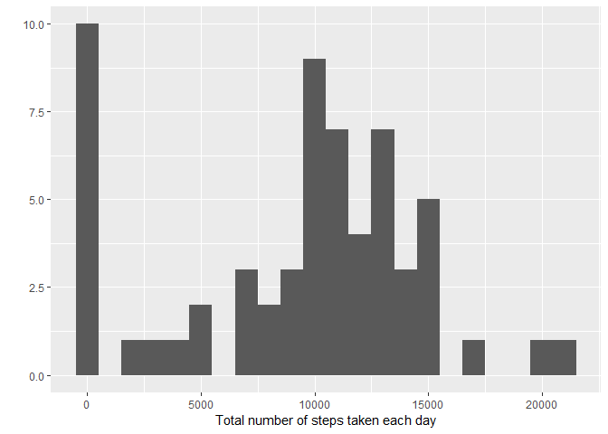
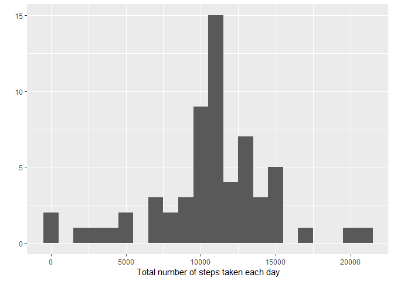

## Loading and preprocessing the data


```r
unzip(zipfile='activity.zip')
data <- read.csv("activity.csv")
```


## What is mean total number of steps taken per day?


```r
library(ggplot2)
# calculating total steps per day
total_steps <- tapply(data$steps, data$date, FUN=sum, na.rm=TRUE)
# Creating a plot 
qplot(total_steps,binwidth=1000,xlab ="Total number of steps taken each day")
```

<!-- -->

```r
# calculate the mean of total steps by day
mean(total_steps,na.rm = TRUE)
```

```
## [1] 9354.23
```

```r
# calculate the median of total steps by day
median(total_steps, na.rm = TRUE)
```

```
## [1] 10395
```


## What is the average daily activity pattern?


```r
library(ggplot2)
# aggregate the steps by intervals
averages <- aggregate(list(steps=data$steps), by = list(interval=data$interval), FUN = mean, na.rm = TRUE)
ggplot(averages, aes(interval, steps)) +
        geom_line() +
        xlab("5-minute intervals")+
        ylab("Average number of steps taken in the interval")
```

<!-- -->

## On average across all the days in the dataset, the 5-minute interval containsthe maximum number of steps?


```r
averages[which.max(averages$steps),]
```

```
##     interval    steps
## 104      835 206.1698
```


## Imputing missing values
There are many days where there are missing values (coded as `NA`). The presence of missing days may introduce bias into some calculations or summaries of the data.

Let's find out how many values are missing and what percent of the total are missing.


```r
#calculating total number  of missing values
sum(is.na(data$steps))
```

```
## [1] 2304
```

```r
#calculating the percentage of missing values
mean(is.na(data$steps))*100
```

```
## [1] 13.11475
```

We will impute all of the missing values with the mean values for that 5-minute interval.


```r
#let's build our function first
fill_value <- function(steps,interval){
        filled <- NA
        if(!is.na(steps))
                filled <- c(steps)
        else
                filled <- (averages[averages$interval==interval,"steps"])
        return(filled)
}
#copy data into another dataframe
filled_data <- data

#imputing the data
filled_data$steps <- mapply(fill_value, filled_data$steps, filled_data$interval)
```

Now, using the filled data set, let's make a histogram of the total number of steps taken each day and calculate the mean and median total number of steps.


```r
total_steps <- tapply(filled_data$steps, filled_data$date, FUN=sum)
qplot(total_steps,binwidth=1000,xlab ="Total number of steps taken each day")
```

<!-- -->

```r
mean(total_steps, na.rm = TRUE)
```

```
## [1] 10766.19
```

```r
median(total_steps, na.rm = TRUE)
```

```
## [1] 10766.19
```


Mean and median values are higher after imputing missing data. The reason behind this is
that in the original data, there are some days with `steps` values `NA` for 
any `interval`. The total number of steps taken in such days are set to 0s by
default. However, after replacing missing `steps` values with the mean `steps`
of associated `interval` value, these 0 values are removed from the histogram
of total number of steps taken each day.


## Are there differences in activity patterns between weekdays and weekends?

First, let's find the day of the week for each measurement in the dataset. In
this part, we use the dataset with the filled-in values.


```r
weekday.or.weekend <- function(date) {
    day <- weekdays(date, abbreviate = FALSE)
    if (day %in% c("Monday", "Tuesday", "Wednesday", "Thursday", "Friday"))
        return("weekday")
    else if (day %in% c("Saturday", "Sunday"))
        return("weekend")
    else
        stop("invalid date")
}

filled_data$date <- as.Date(filled_data$date)

filled_data$day <- sapply(filled_data$date, FUN=weekday.or.weekend)
```

Now, let's make a panel plot containing plots of average number of steps taken
on weekdays and weekends.


```r
library(ggplot2)
averages <- aggregate(steps ~ interval + day, data = filled_data, mean)

ggplot(averages, aes(interval,steps)) + 
        geom_line() +
        facet_grid(day~.) +
        xlab("5-Minute interval") +
        ylab("Number of steps")
```

<!-- -->
